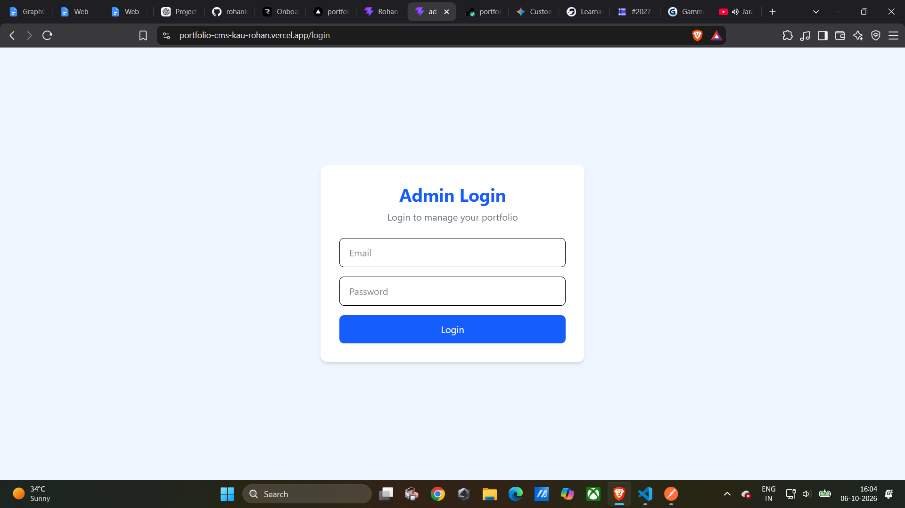
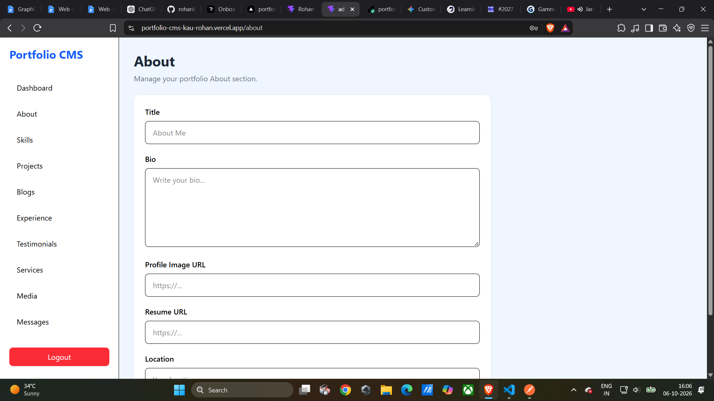
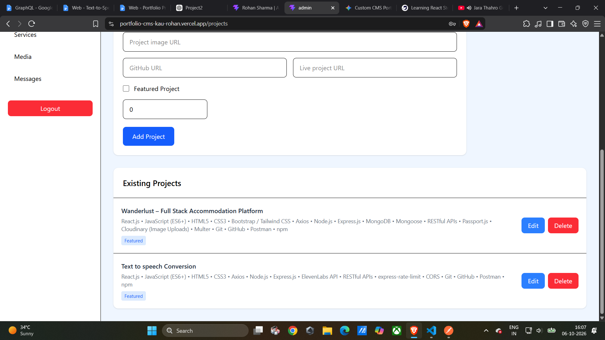
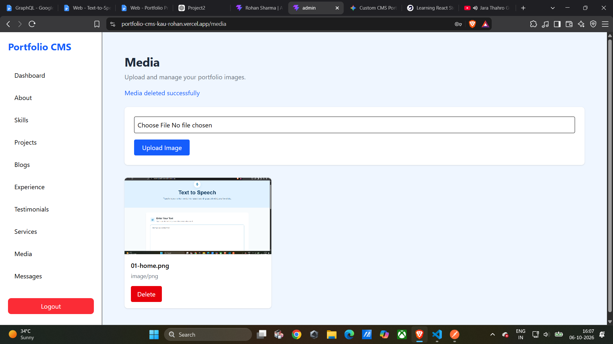
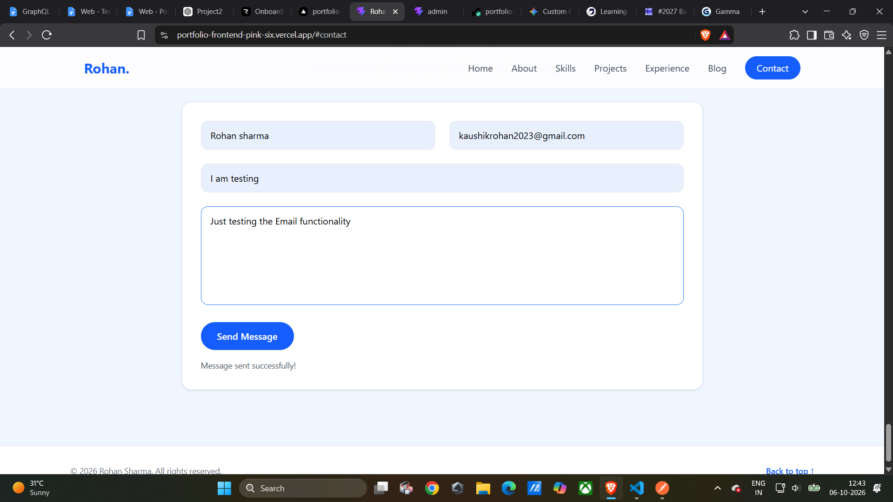

# Project Working Documentation

## Portfolio Website with Custom CMS

This document demonstrates the working of the Portfolio Website and its Custom Content Management System through screenshots of the implemented features.

---

## 1. Public Portfolio Homepage

The public portfolio website provides visitors with an overview of the portfolio and access to the different sections of the website.


---

## 2. Admin Login

The Admin Panel provides a secure login interface for administrators. Authentication is implemented using JWT-based authentication.



---

## 3. Admin Dashboard

After successful authentication, the administrator can access the CMS dashboard and manage the portfolio content.



---

## 4. Projects Management

The Projects section allows the administrator to manage portfolio projects through the CMS.

Projects can be created, updated and deleted using the available management functionality.



---

## 5. Media Management

The Media section allows administrators to upload and manage portfolio media through the CMS.

Media files are handled using Cloudinary.



---

## 6. Contact Form

The public Contact section allows visitors to submit messages through the portfolio website.

Submitted messages are processed by the backend and stored for administration.



---

## 7. Admin Messages

The Admin Messages section allows the administrator to view and manage messages submitted through the public contact form.


---

## Project Working Flow

The complete working flow of the project is:

```text
Visitor
   |
   v
Public Portfolio
   |
   v
Contact Form
   |
   v
Backend REST API
   |
   +----> MongoDB
   |
   +----> Email Notification
   |
   v
Admin Panel
   |
   v
Content Management
```

The Custom CMS allows administrators to manage portfolio content without directly modifying the frontend source code.

## Conclusion

The project provides a complete full-stack portfolio solution with a public-facing website, authenticated Custom CMS, REST APIs, database integration, media management and contact message handling.
